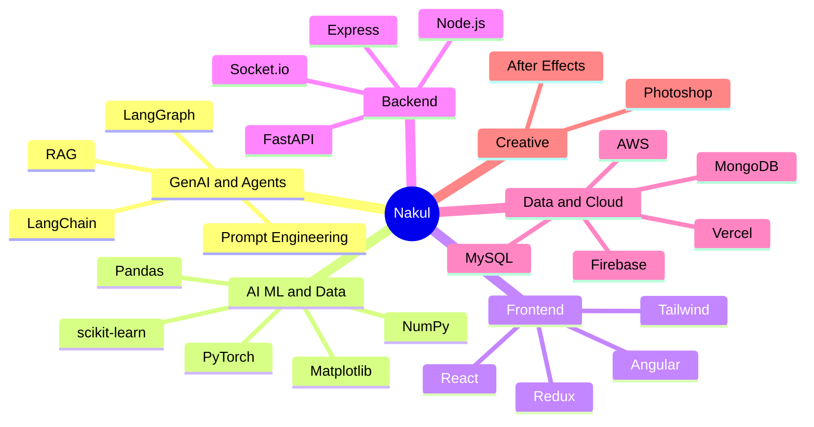

<!-- ===================== HEADER ===================== -->

  

  

 

<!-- ===================== ABOUT ===================== -->
## 💫 About Me

🔭 **Now building:** a **multi-platform AI agent**

💬 **Also shipped:** a real-time chat app with multi-functionality

🌱 **Currently learning:** AI/ML, **Agentic AI** (RAG, LangChain, LangGraph)

📫 **Reach me:** [work.nakul.08@gmail.com](mailto:work.nakul.08@gmail.com)

 

 

<!-- ===================== SKILL EXPLORER ===================== -->
## 🧰 Skill Explorer
👇 Click any category to expand it

  

<b>🤖 &nbsp;GenAI & Agentic AI</b> &nbsp;(my current focus)

 

<b>🧠 &nbsp;AI / ML & Data Science</b>

 

<b>🎨 &nbsp;Frontend</b>

 

<b>⚙️ &nbsp;Backend & Real-time</b>

 

<b>🗄️ &nbsp;Databases</b>

 

<b>☁️ &nbsp;Cloud, Deploy & Tools</b>

 

<b>💻 &nbsp;Core Languages</b>

 

<b>🎬 &nbsp;Creative</b>

 

 

<b>🗺️ &nbsp;See my skill map</b> &nbsp;(interactive mindmap)

 

 

<!-- ===================== LEARNING ROADMAP ===================== -->
## 🚀 Currently Leveling Up

- [x] Full-stack web development (React, Node.js, Express)
- [x] Real-time apps with Socket.io
- [ ] AI / Machine Learning & Data Science
- [ ] Retrieval-Augmented Generation (RAG)
- [ ] LangChain & LangGraph agent workflows
- [ ] Multi-platform AI agent (in progress)

 

<!-- ===================== PROJECTS ===================== -->
## 🛠️ Featured Work

<table width="100%">
<tr>
<td width="50%" valign="top">

### 🤖 Multi-Platform AI Agent
An AI agent that works across multiple platforms. *In progress.*

**Stack:** Python · LangChain · LangGraph · RAG

</td>
<td width="50%" valign="top">

### 💬 Real-Time Chat App
A multi-functionality chat application with live messaging. AI features planned.

**Stack:** React · Node.js · Express · Socket.io · MongoDB

</td>
</tr>
</table>

 

<!-- ===================== CONTRIBUTION ACTIVITY ===================== -->
## 🔥 Contribution Activity

  

  

  

<b>🐍 &nbsp;Contribution snake</b> &nbsp;(eats my commits, updates every 12 hours)

 

<picture>
  <source media="(prefers-color-scheme: dark)" srcset="https://raw.githubusercontent.com/nakul-xd/nakul-xd/output/github-snake-dark.svg" />
  <source media="(prefers-color-scheme: light)" srcset="https://raw.githubusercontent.com/nakul-xd/nakul-xd/output/github-snake.svg" />
  
</picture>

 

<!-- ===================== STATS ===================== -->
## 📊 GitHub Analytics

  
  

 

<!-- ===================== CONTACT ===================== -->

### 🤝 Let's build something together

Open to collaborations, ambitious products and useful engineering work.

  

